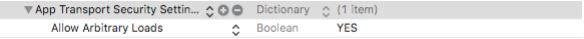
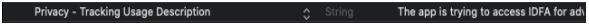

# 유니티 연동가이드 &nbsp;<sub>[En](./README.md)</sub>&nbsp;<sub>[Ko](./README.ko.md)</sub>

1. [개요](#1-개요)

2. [제나애드 웹 콘솔에서 광고생성 및 광고 ID 가져오기](#2-제나애드-웹-콘솔에서-광고생성-및-광고-id-가져오기)

3. [SDK 설치](#3-sdk-설치)
    * Import
    * 폴더 설명

4. [퍼미션](#4-퍼미션)
    * Android
    * iOS

5. [연동하기](#5-연동하기)
    * SDK 초기화
    * 광고 준비요청
    * 광고 준비확인
    * 광고 보이기
    * 배너 위치 지정
    * 배너 제거
    * 코드 샘플
    * 콜백 목록
    * 콜백 매개변수 목록
    * 서버응답 메시지 목록

6. [테스트 및 승인요청](#6-테스트-및-승인요청)
    * 테스트
    * 승인 요청방법

7. [추가정보](#7-추가정보)

<br/><br/><br/><br/><br/>

## 1. 개요
---
<br/>

* 실제 프로젝트 환경에 SDK 적용을 위한 가이드 문서입니다.

* 유니티 2019.4.5f1 이상, android API Level 19 이상, iOS 9.0 이상의 환경에서 적용을 권장하며 제나애드 웹 콘솔에서 발급받은 "광고 ID" 및 최신 SDK 가 별도로 필요합니다.

* 샘플 프로젝트 실행시에는 실제 발급받은 "광고 ID"로 수정 후 실행해야 합니다.

<br/><br/>

## 2. 제나애드 웹 콘솔에서 광고생성 및 광고 id 가져오기
---
<br/>

1. 앱 생성. (앱 관리 / 앱 생성)

2. 광고 생성. (광고 관리 / 광고 생성)

3. 생성된 광고에 "광고 ID"를 이용해 프로젝트 내에서 함수를 실행 할 수 있습니다.

<br/><br/>

## 3. sdk 설치
---
<br/>

샘플 프로젝트와 sdk 가 포함된 유니티 패키지 파일을 제공합니다.

* Import

    1. Unity 프로젝트를 먼저 엽니다.

    2. Aseet -> Import Package -> Custom Package -> zena2d_sdk.unitypackage -> 열기

    3. Import 버튼을 누르면 패키지에 설정된 파일구조와 동일하게 프로젝트에 포함됩니다.

* 폴더 설명

    - Assets\Plugins\Android : Zena2D 에서 사용되는 Android 패키지 입니다.
    
    - Assets\Plugins\iOS : Zena2D 에서 사용되는 iOS 패키지 입니다.

    - Assets\Zena2d : Zena2D 광고호출 API 를 제공해주는 C# 코드입니다.

    - Assets\Zena2d_Guide : 샘플 프로젝트와 실행코드 입니다.

<br/><br/>

## 4. 퍼미션
---
<br/>

* Android

    - Zena2D SDK 의 .aar 패키지 내에 AndroidManifest.xml 파일을 포함하고 있으며 프로젝트에 또다른 AndroidManifest.xml 파일이 있다면 빌드시 자동 병합됩니다.   
    Zena2D 에서 사용중인 퍼미션 :
    ```
    <uses-permission android:name="android.permission.INTERNET" />
    ```

    - Proguard 적용 후 광고가 보이지 않을 경우 :   
    Publishing Setting – User Proguard File 체크를 했다면 Assets\Plugins\Android\proguard-user.txt 파일이 존재합니다. 여기에 아래 옵션을 추가해 주세요.
    ```
    -keep class com.rhaon.aos_zena2d_sdk.**
    -keep interface com.rhaon.aos_zena2d_sdk.**
    ```

    - 동영상 광고가 보여질 때 크래시가 나는 경우 :   
    \Plugins\Android\gradleTemplate.properties 파일을 생성합니다. 여기에 아래 옵션을 추가해 주세요.
    ```
    android.enableDexingArtifactTransform=false
    ```

* iOS

    - 네트워크를 사용하기 위해 iOS 로 빌드 후, 생성된 xcode 프로젝트에서 info.plist 파일에 아래의 키값을 추가, 변경이 필요합니다.

       

    - iOS 14 이상에서는 IDFA 정책 변경으로 info.plist 파일에 아래의 키값이 필요합니다.   
    (String : The app is trying to access IDFA for advertising purposes.)

       

<br/><br/>

## 5. 연동하기
---
<br/>

* SDK 초기화
    ```c#
    public void Client.Init( "BANNER ID", "INTERSTITIAL ID", "VIDEO ID" );
    ```
<br/>

* 광고 준비요청
    ```c#
    public void Client.ReadyAd( Product, "BANNER ID or INTERSTITIAL ID or VIDEO ID" );
    // Product : Product.BANNER, Product.INTERSTITIAL, Product.VIDEO
    // (광고종류 : 배너광고, 전면광고, 동영상광고)
    ```
<br/>

* 광고 준비확인
    ```c#
    public bool Client.IsReadyAd( Product );
    // Product : Product.BANNER, Product.INTERSTITIAL, Product.VIDEO
    // (광고종류 : 배너광고, 전면광고, 동영상광고)
    ```
<br/>

* 광고 보이기
    ```c#
    public void Client.CreateAd( Product );
    // Product : Product.BANNER, Product.INTERSTITIAL, Product.VIDEO
    // (광고종류 : 배너광고, 전면광고, 동영상광고)
    ```
<br/>

* 배너 위치 지정
    ```c#
    public void Client.SetBannerGravity( BannerMode );
    // BannerMode : BannerMode.BOTTOM, BannerMode.TOP, BannerMode.SOFT_KEY
    // (배너위치 :하단, 상단, 소프트키 위)
    ```
<br/>

* 배너 제거
    ```c#
    public void Client.RemoveBanner( );
    ```
<br/>

* 코드 샘플
    ```c#
    private Client client;
    
    void Start ( ) {
        client = Zena2dClient.BuildClient( );
        client.setBannerGravity(BannerMode.BOTTOM);
        client.callbackInit = OnInit;
        client.callbackError = OnError;
        client.callbackReady = OnReady;
        client.callbackCreate = OnCreate;
        client.callbackReward = OnReward;
        client.callbackClick = OnClick;
        client.callbackClose = OnClose;
        client.Init( "BANNER ID", "INTERSTITIAL ID", "VIDEO ID" );
    }
    
    //--------------------callback--------------------//
    
    public void OnInit( bool isInit, string message ) {
        Debug.Log( "OnInit : " + isInit + " : " + message);
        //ex : 배너광고 준비
        if ( isInit ) client.ReadyAd( Product.BANNER, "BANNER ID" );
    }

    public void OnError( int product, string message, string detail ) {
        Debug.Log( "OnError : " + product + " : " + message + " : " + detail);
    }
    
    public void OnReady( int product, bool success, string message ) {
        Debug.Log( "OnReady : " + product + " : " + success + " : " + message );
        //ex : 배너광고 준비확인 및 생성
        if ( client.IsReadyAd( product )) client.CreateAd( product );
    }
    
    public void OnCreate( int product, bool success, string message ) {
        Debug.Log( "OnCreate : " + product + " : " + success + " : " + message );
    }
    
    public void OnReward( int product, string reward, int count ) {
        Debug.Log( "OnReward : " + product + " : " + reward + " : " + count );
    }
    
    public void OnClick( int product ) {
        Debug.Log( "OnClick : " + product );
    }
    
    public void OnClose( int product, string medID ) {
        Debug.Log( "OnClose : " + product + " : " + medID );
        //ex : 광고 닫힘과 동시에 다음 광고준비
        client.ReadyAd( (Product)product, medID );
    }
    ```
<br/>

* 콜백 목록

    |콜백|설명|
    |---|---|
    |callbackInit(bool, string) |client.Init( ); -> SDK 초기화 후 성공여부를 알려줍니다.|
    |callbackError(int, string, string) |네트워킹 오류 및 응답 오류시 호출됩니다.|
    |callbackReady(int, bool, string) |client.ReadyAd( ); -> 광고요청, 광고로드를 진행하며 광고준비 성공여부를 알려줍니다.|
    |callbackCreate(int, bool, string) |client.CreateAd( ); -> 준비된 광고를 화면에 표시합니다.|
    |callbackReward(int, string, int) |보상형 광고의 보상조건 충족시 호출됩니다.|
    |callbackClick(int) |광고 클릭시 호출됩니다.|
    |callbackClose(int, string) |광고 및 포인트 윈도우가 닫힐때 호출됩니다.|
<br/>

* 콜백 매개변수 목록

    |매개변수|설명|
    |---|---|
    |bool isInit |광고연동 준비상태.|
    |bool success |해당함수의 성공여부.|
    |string message |응답에 대한 상태 및 메시지.|
    |string detail |에러발생시 디테일 메시지.|
    |string reward |보상형 광고에서 설정한 보상이름.|
    |string medID |광고 준비시 전달한 medID.|
    |int product |광고 구분 - 0 or 1 or 2 (0 : BANNER, 1 : INTERSTITIAL, 2 : VIDEO)|
    |int count |보상형 광고에서 설정한 보상갯수.|
<br/>

* 서버응답 메시지 목록

    |메시지|설명|
    |---|---|
    |SUCCESS |성공.|
    |UNKNOWN |알 수 없는 에러입니다.|
    |UNKNOWN_MEDID |알 수 없는 미디어(광고) 아이디 입니다.|
    |AD_DISABLED |광고 비활성화 상태입니다. (웹콘솔 광고 관리에서 노출 중지 한 경우)|
    |AD_NOTFOUND |광고가 없습니다.|
    |AD_EXPIRED |준비된 광고가 만료되었습니다. ReadyAd( )가 필요합니다.|
    |ALREADY_ADREQ |중복된 광고 요청입니다. – sdk 에러.|
    |EXCEEDED_IMPRESSION |노출횟수가 초과 되었습니다. (웹콘솔 광고 관리에서 노출 횟수를 설정한 경우)|

<br/><br/>

## 6. 테스트 및 승인요청
---
<br/>

* 테스트

    - 아래와 같은 제나애드 기본광고가 노출되면 정상입니다.

        |타입|보기|
        |:---:|:---:|
        |배너 |</img>|
        |전면 |</img>|
        |비디오 |</img>|
<br/>

* 승인 요청방법

    - 출시 직전이나 출시 후 승인 요청하면 실제광고가 노출되고 정산됩니다.

    - 다음은 승인요청 메일 예시입니다.   
    <br/>
    수신 : help@zenaad.com <br/>
    내용 : 제나애드 계정 이메일 (필수) : 예) publisher@zenaad.com <br/>
    &nbsp;&nbsp;&nbsp;&nbsp;&nbsp;&nbsp; 회사명 (필수) : 예) (주)제나애드 <br/>
    &nbsp;&nbsp;&nbsp;&nbsp;&nbsp;&nbsp; 앱 이름 (필수) : 될 수 있으면 스토어에서 검색 가능한 이름 <br/>
    &nbsp;&nbsp;&nbsp;&nbsp;&nbsp;&nbsp; 스토어 주소 (선택) : 유효한 URL 주소

<br/><br/>

## 7. 추가정보
---
<br/>

* Zena2D 에서는 광고식별자 (ADID, IDFA)를 활용하며 리소스의 효율적인 사용을 위해 캐쉬 데이터를 저장합니다. (최대 256MB)

<br/><br/>
